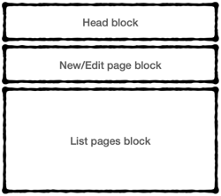

# GWiki
A Go (language)-based Wiki

## Context
[Instiki](https://golem.ph.utexas.edu/wiki/instiki/show/HomePage) has been my personal wiki for a number of years already (gee... fifteen, to be precise!). It made me discover [Ruby-on-Rails](https://rubyonrails.org), it has served its purpose, but now I need something different. And... I wanted to learn [Go](https://go.dev)!

Therefore this project.

**Note:** I've got a similar effort running for a some time, but using **ruby** [here](https://github.com/jbonnet/yarwiki).

## Features
**As** this wiki's user, **I want to be able to**:

1. Quickly start taking notes on a new page, without having to request a 'new' page to be sent from the server;
2. Quickly take a look at the most recent notes taken;
3. Have a powerfull search feature that allowes jumping into already written pages;

These very highlevel features imply the following lower-lever user stories:

**As** this wiki's user, **I want to be able to**:
1. Click on a link or button and start writing the title/body of a new page, **so that** writing of new pages is easier than the current option of clicking the *Edit* link at the bottom of the page;
2. See the most recently written page on top of the list of pages, **so that** previous posts are also avalilabe to be seen nearby the current one;
3. Scroll to see older posts, without having to click a 'next page' link, **so that** access to older posts is faster;
4. Click one specific post to see the whole post's body, **so that** I do not have to wait for an entire page load;
5. Double click one specific post to edit it, **so that** I do not have to click a specific link or button to edit the post;

All these User Stories show that, instead of a pure Wiki, what we're really for here is a kind of **Blog** like interface, with interconnection between pages (or blog posts) made with wiki pages-like names.

## Concepts
This section explains the concepts used.

* **Pages:** wikis are a collection of interlinked pages;
* **Slug:** an HTTP-safe string that is obtained by transforming another string (e.g., the page's title, like `Hello, World!` would give us `hello-world`)

## Design
This section discusses the design of some of the features we want for this wiki.

### How to identify a wiki page
When accessing a single wiki page, we'll want to uniquely identify it (a primary key, in database talk). We see two different options for that, with pros and cons:

1. Use an existing attribute of the page, such as its title (or its slug):
    * Pros: it is easier to recognize a page when you get just its URL (e.g., `https://example.com/my-fist-page`);
    * Cons: the page history and connections are lost if you change the title of the page;
1. Use an extra attribute, such as an id:
    * Pros: you can change the page's title, but their links remain the same;
    * Cons: it is harder to recognise a page, specially if UUIDs are used;

Trying to get the most of both solutions, we may:

1. Use an id, allowing the change of the name of page without loosing their connections;
2. Use a slug from the page title to select a specific page;

This means we'll have a `primary key` on the `id` field and a `unique` restriction on the `slug` field, calculated from the `title` field.

### One clic to see the whole page, two to edit it
### Add new page on top of the stream
### Continuous scroll
### Possible solutions
The above written requirements pushed me into the following first solution:

A Single Page Application (SPA), with three (main) sections:

1. a **Header** block on top, always visible, holding a *Search* field and a button to add new pages;
2. an **Editing** block, shown only when the 'new page' button of the Header is clicked, or when the user wants to edit a specific page (see below);
3. a **List of Pages** block, where all pages should be listed (see below), sorted *desc* by updating date (most recent change on top);

See below a picture of this page organization:

Events flowing on top of this structure would be the following:

1. the default focus woul be the **List of Pages**;
1. a **single click** on one of the pages would show it occupying all the needed space:
    1. a **single click** on a cancel link would leave the page unchanged and show the list pages as it was before being edited;
    1. a **double click** on the page would allow the edition of the content of that page, on a form at the top of the List of Pages:
1. a **double click** on one of the pages would allow the edition of the content of that page, on a form at the top of the List of Pages:
    1. a **single click** on the save button would save the page's changes and show the updated list of pages (with the newly changed page at the top);
    1. a **single click** on a cancel link would leave the page unchanged, close the form and show the list pages as it was before the page had been being edited;
1. a **single click** on the 'new page' button would show a form allowing the creation of a new page:
    1. a **single click** on the save button would save the page's content and show the updated list of pages (with the newly created page at the top);
    1. a **single click** on a cancel link would leave the page unchanged, close the form and show the list pages as it was before the new page being created;
1. a **single click** on the **Search** field would make it the focus of the whole page, allowing the user to write the terms of his/her search:
    1. a **single click** on a **Search** button would fetch all pages containning the search terms (possibly with a highlight feature), sorted in the same way (descendent, by the updated date -- more complex sorting algorithms might be added later):
        1. **single** or **double clicks** should work on this list as described above;
        1. a **single click** (or **escape**?) on a cancel link would clear the syntaxe highlighting and return the **List of Pages** to the state it was before the search;
    1. a **single click** on a cancel link would leave the **List of Pages** unchanged, making it the focus again;

## Possible items to deal with later on

* Ruby version
* System dependencies
* Configuration
* Database creation
* Database initialization
* How to run the test suite
* Services (job queues, cache servers, search engines, etc.)
* Deployment instructions

## References

1. [Bootstrap-based web application scaffolding built in Go on top of the Revel Web Framework w/ Docker build support](https://github.com/richtr/baseapp)
1. [Vuejs + Golang = A rare combination](https://link.medium.com/onnXssA0I8)
1. [go-bootstrap: Generates a lean and mean Go web project](http://go-bootstrap.io/)
1. [Hexagonal Architecture in Go](https://medium.com/@matiasvarela/hexagonal-architecture-in-go-cfd4e436faa3), [Matías Varela](https://medium.com/@matiasvarela)
